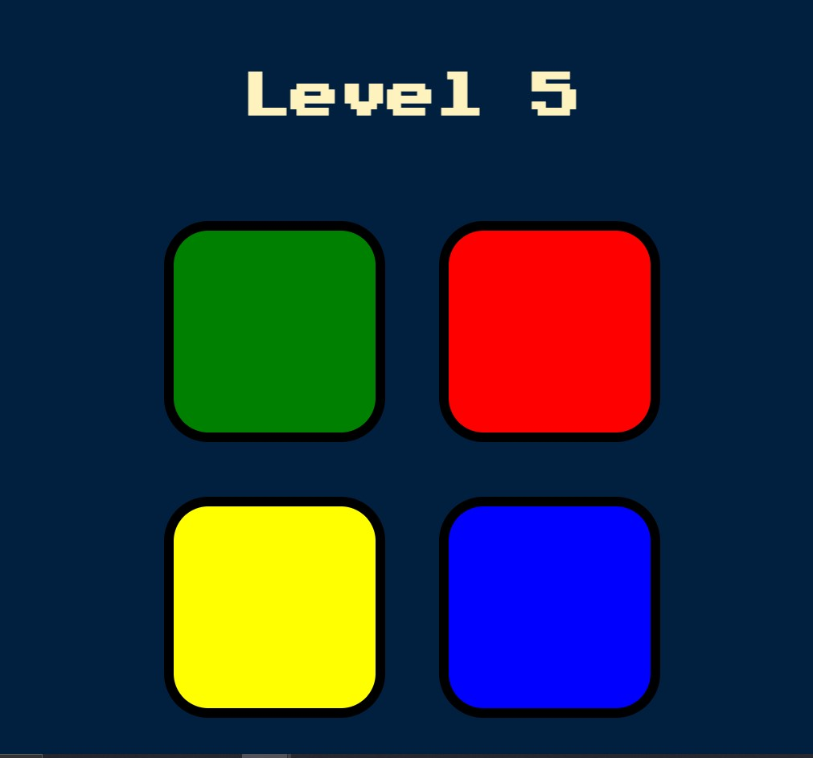

# simon-game

>The Simon game is an exciting game of lights and sounds in which players must repeat random sequences of lights by pressing the colored pads in the correct order. 
>It's fast-paced play, with lights and sounds that can challenge the player. 

## Technologies used:
>- HTML
>- CSS
>- jQuery
>- Javascript.

## Snapshot

